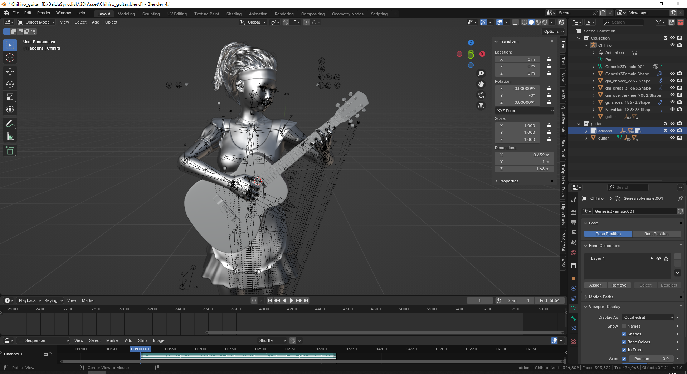

## FretDance

[中文说明点击这里](readMeCN.md)

Because this project is rewritten with Rust,so the Python version is no longer maintained.But the blender plugin is still available.
portal to Rust Version: [fretDance Rust](https://github.com/highmore9501/fretDance_rust)

Electric Guitar Performance Video: [Furina - Maiden's Capriccio](https://www.bilibili.com/video/BV183t9zXEu6/)

Classical Guitar Performance Video: [Jeht - Bird's Poem](https://www.bilibili.com/video/BV1HmY6zEEwZ/)

For detailed tutorials and documentation, please visit my Zhihu Column (知乎专栏): [fretDance Column](https://www.zhihu.com/column/c_1932748054936684153)

Tutorial in BiliBili: [FretDance Video Tutorial](https://www.bilibili.com/video/BV1jYp8zQEh2/?spm_id_from=333.1387.0.0)

### About Addon

The content in the `fret_dance_addon` folder is a Blender add-on. To use it, compress the entire folder into a zip file, then locate and install this zip file through Blender's add-on installation interface.

The add-on is designed to assist with the initialization setup process for character models.

### Note to English Readers:

Due to the extensive documentation content, I recommend viewing my Zhihu Column for complete information.

As the author is not a native English speaker, this README may contain machine-translated text. For better understanding, I suggest English readers:

1. Visit my Zhihu Column
2. Use browser translation plugins for optimal reading experience

The automatic translation from Chinese to English typically provides more accurate results than my direct machine translation here.
