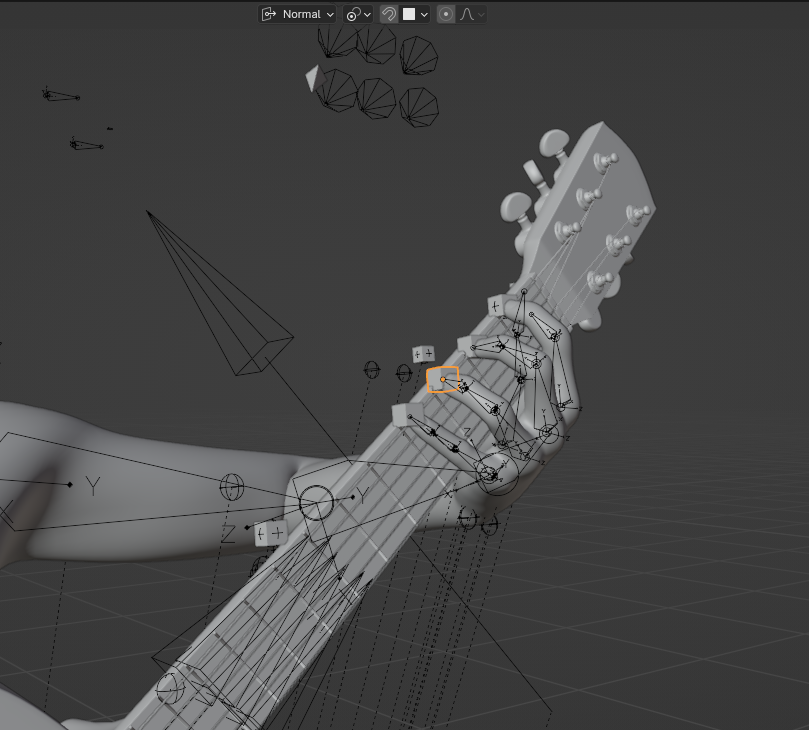
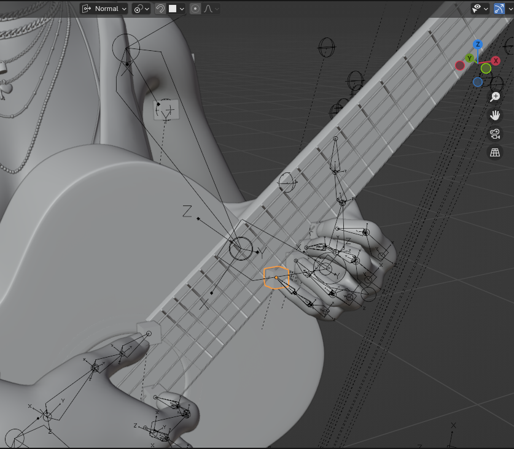
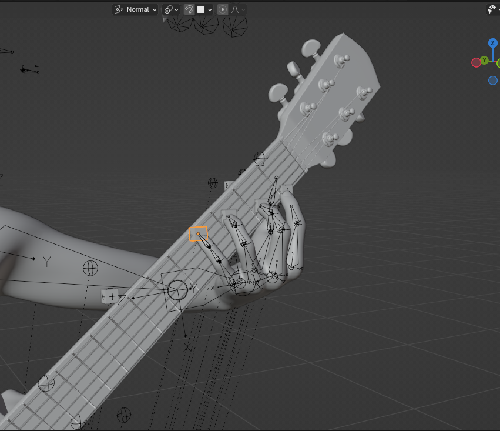
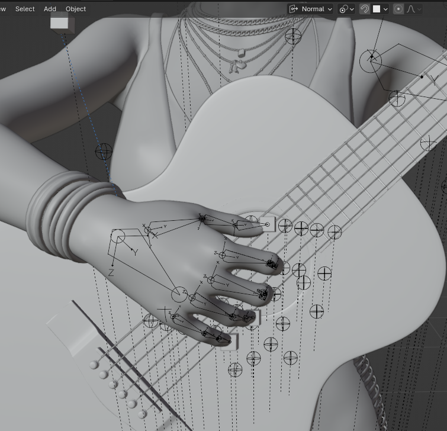
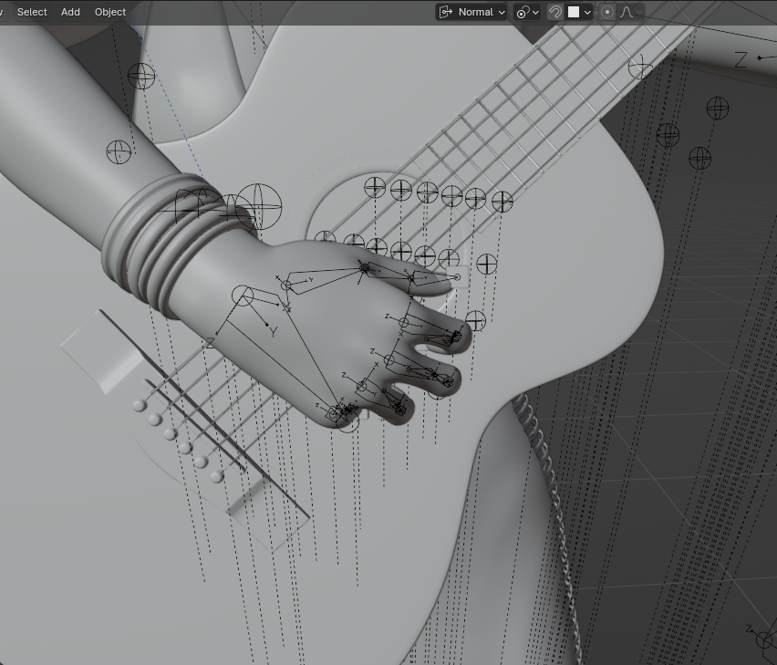

## FretDance


[中文说明](https://github.com/highmore9501/fretDance/blob/master/readMeCN.md)

Convert the original MIDI file into a guitar tablature fingering arrangement that minimizes the movement trajectories of both hands. Ultimately, present the performance animation in Blender.

Demo video in BiliBili: [https://www.bilibili.com/video/BV1my411Y72J/](https://www.bilibili.com/video/BV1my411Y72J/)


### How to run

- Install a virtual environment by running `python -m venv .venv`
- Activate the virtual environment by running `source .venv/bin/activate`. For Windows, it is `.\.venv\Scripts\activate`
- Install dependencies by running `pip install -r requirements.txt`
- Run `python main.py`, then select the avatar and midi file in the interface, set the `FPS` and the pitch of each string, and click submit to generate the json data required for the animation.
- Open the corresponding blender file where the avatar is located, go to the `script` interface, select the `animate` file, then copy the absolute paths of the two json files generated in the previous step to the corresponding variables, and click run to generate the animation.
  

### Simple working principle

1. Read all notes from the MIDI file, treat simultaneously sounding notes as chords, and record the time of the chord.
2. Convert each chord into possible positions on the guitar.
3. Consider which finger to use to press each note, generating all possible fingering hand shapes.
4. Calculate the cost of transitioning from the current hand shape to a new hand shape.
5. Each time a hand shape is iterated, a recorder is generated to record all previous hand shapes and the cost of reaching the current hand shape. For example, at the beginning there is only one hand shape, and pressing the next note may result in 6 new hand shapes, so 6 recorders will be generated. Each recorder records the cost from the original hand shape to the new hand shape. Then when pressing the next note, iterate these 6 new hand shapes again, generating new recorders, and so on.
6. Obviously, you will find that the growth rate of recorders is exponential, so we need pruning. The pruning method is to set an upper limit on the number of recorders for each generation, keeping only a certain number of recorders with the smallest cost values, while discarding other recorders. In the project, we use the size attribute of HandPoseRecordPool to control the number of recorders.
7. Finally, we just need to find a recorder with the smallest cost value, and then output the recorded hand shape sequence from it, which is the optimal solution we are looking for.
8. With the optimal solution for the left hand, we can calculate the optimal solution for the right hand based on this. According to the string to be played each time, calculate the position of the right hand shape and which finger is more scientific to play. The calculation principle is similar to the previous calculation of the left hand shape, which is also continuous iteration, and then controlling the total number of descendants, finally finding the optimal solution.

### Generating animations

Since we already have all the finger information for each time, we can convert this information into keyframe information for controlling hands and arms in Blender files through a series of calculations, thus generating animations.

The basic principles of animation generation are as follows:

1. On the Blender file, read the hand shape information at the four extreme positions of the guitar panel. These four extreme positions are the 1st fret 1st string, 1st fret 6th string, 12th fret 1st string, and 12th fret 6th string.
2. At the above four extreme positions, there are three possible palm angles, corresponding to the NORMAL state when the index finger and middle finger do not press the same fret, the INNER state when the index finger and middle finger press the same fret and the index finger points inward, and the OUTER state when the index finger and middle finger press the same fret and the index finger points outward.
3. By judging the hand shape information at each time, and then interpolating among the data of these extreme positions and corresponding hand shapes, we can obtain a series of controller information for each keyframe, thereby generating animations.
4. The principle of the right hand animation is to determine several possible parking positions for the right palm near the sound hole, and find some possible finger contact positions on the six strings. Each time you want to play, place the corresponding palm and fingers on these playing positions.

In the asset/blender folder, there are some character blender files, but they are outdated. Due to the file size limit for uploads on GitHub, you can download the project-related character blender files from this cloud storage address: [pan.baidu.com/s/1nmLxx_CDISWWvsQJXYuvew?pwd=dt7h](https://pan.baidu.com/s/1nmLxx_CDISWWvsQJXYuvew?pwd=dt7h)

In the Blender folder, there are some scripts that run in Blender, which serve the above purposes.

### How to Initialize a Custom Avatar Model

If you want to use your own avatar model, you can follow these steps to initialize it:

#### Skeleton Structure Requirements

- It is recommended to refer to the character model in `asset/blender/character.blend` and bind the guitar to the avatar's upper chest bone. This ensures that all hand movements are relative to the upper chest, so the avatar's upper body movement during performance does not affect finger movements.
- The parent-child relationships of the left and right hand bones should also follow the structure in the reference model, using a standard humanoid skeleton. Both the palm and fingers should have IK (Inverse Kinematics) bones enabled. The IK target for the palm should be the shoulder, and the IK target for the fingers should be the palm bone.

#### Left Hand Initialization

The positioning method for the left hand is as follows:

Finger positioning is relatively simple. You only need to determine the coordinates of four key points on the guitar, and then use interpolation to calculate the position of any string and fret. These four points are:

- 1st string, 1st fret
- 1st string, 12th fret
- 6th string, 1st fret
- 6th string, 12th fret

However, finger positions alone are not enough. In actual performance, different positions and string/fret combinations will cause the overall position and rotation of the left hand to change, and the palm's IK Pivot will also change accordingly. Therefore, you need to record the palm position, angle, and IK Pivot in 8 typical scenarios:

- Four fingers pressing the 1st string at the 1st, 2nd, 3rd, and 4th frets (P0_Normal)  
  
- Four fingers pressing the 6th string at the 1st, 2nd, 3rd, and 4th frets (P1_Normal)  
  
- Four fingers pressing the 1st string at the 12th, 13th, 14th, and 15th frets (P2_Normal, difficult for classical guitar)  
  
- Four fingers pressing the 6th string at the 12th, 13th, 14th, and 15th frets (P3_Normal, prone to mesh penetration)  
  
- Four fingers pressing the 1st string 1st fret, 2nd string 2nd fret, 3rd string 3rd fret, 4th string 4th fret (P0_Outer)  
  
- Four fingers pressing the 6th string 1st fret, 5th string 2nd fret, 4th string 3rd fret, 3rd string 4th fret (P1_Inner)  
  
- Four fingers pressing the 1st string 12th fret, 2nd string 13th fret, 3rd string 14th fret, 4th string 15th fret (P2_Outer, not actually playable but used for interpolation)  
  
- Four fingers pressing the 6th string 12th fret, 5th string 13th fret, 4th string 14th fret, 3rd string 15th fret (P3_Inner, prone to mesh penetration)  
  

With the palm position, angle, and IK Pivot of these 8 hand shapes, you can interpolate to calculate the palm parameters for any position and hand shape, enabling animation for any hand pose.

Left hand initialization involves the following Collections:

- **HandPositionControllers**: Palm controllers, controlling palm position, thumb position, and palm IK Pivot. The naming prefixes are H (palm), HP (IK Pivot), T (thumb), with suffixes \_L (left hand) and \_R (right hand).
- **FingerPositionControllers**: Finger position controllers, controlling the position of each finger. Naming prefixes are I (index), M (middle), R (ring), P (pinky), with the same suffixes as above.
- **RotationControllers**: Palm rotation controllers, controlling the rotation of the palm bone. Only H_Rotation_L and H_Rotation_R exist.

All controllers are represented as cubes in Blender for easy viewing in the 3D viewport.

After setting each hand shape, use the `set_left_controller_info(position_name, status_name)` method in the script `import_left_controller_info.py` to save all controller information for the current hand shape. The script also provides the `import_right_controller_info` method to quickly import existing controller information for fine-tuning.

All saved positions are represented as sphere empty objects in Blender for easy viewing and management.

#### Right Hand Initialization

The principle for initializing the right hand is similar to the left hand. By setting up several common hand shapes, you can determine the plucking points of different fingers on each string, as well as the corresponding palm position, angle, and IK Pivot (IK Pivot can be omitted for some models).

The key right hand shapes are as follows (pima stands for thumb, index, middle, and ring fingers, following classical guitar naming conventions):

```python
right_hand_test_positions = {
    0: {"p": 2, "i": 0, "m": 0, "a": 0}, # Thumb on 3rd string, ima all on 1st string, similar to playing tremolo on 1st string
    1: {"p": 3, "i": 1, "m": 1, "a": 0}, # Thumb on 4th string, im on 2nd string, a on 1st string, transitional hand shape
    2: {"p": 4, "i": 2, "m": 1, "a": 0}, # Thumb on 5th string, i on 3rd string, m on 2nd string, a on 1st string, standard starting shape
    3: {"p": 5, "i": 4, "m": 3, "a": 2}, # Thumb on 6th string, i on 5th string, m on 4th string, a on 3rd string, standard bass string shape
    4: {"p": '_end', "i": '_end', "m": '_end', "a": '_end'} # End of strumming, all pima below the 1st string
}
```






After setting these hand shapes (position 1 is optional), use the `set_right_controller_info(hand_position)` method in `import_right_controller_info.py` to save the hand shape information. All positions are represented as sphere empty objects in Blender for easy viewing.

In fact, it is not necessary to save every possible hand shape. Observation shows that the plucking points are roughly aligned in a line, so after completing several key hand shapes, you can manually fine-tune

### Other

The purpose of this project is not to output tabs for humans to read, because traditional tabs only record the movement of the left hand fingers that need to be pressed, but lack recording of the positions of the unused left hand fingers.
Of course, for humans, this does not matter, because humans will naturally move their unused fingers to places they feel appropriate.
However, when considering animation generation, which requires the position information of each finger at each keyframe, traditional tabs are not enough.
Therefore, the goal of this project is to output a sequence containing all finger information for each beat, so as to provide sufficient information for animation generation.
