## FretDance


将原始的 midi 文件，转化成吉它曲谱的指法编排，使得双手的移动轨迹最小化。并且最终在 blender 中呈现演奏动画。

BiliBili 成品视频：[https://www.bilibili.com/video/BV1my411Y72J/](https://www.bilibili.com/video/BV1my411Y72J/)


### 运行方法

- 安装虚拟环境，运行 `python -m venv .venv`
- 激活虚拟环境，运行 `source .venv/bin/activate`。如果是 windows 则为 `.\.venv\Scripts\activate`
- 安装依赖，运行 `pip install -r requirements.txt`
- 运行 `python main.py`，然后在界面中选择 avatar 和 midi 文件，设置好 `FPS`，以及各弦的音高，点击提交即可生成动画所需要的 json 数据。
- 打开对应 avatar 所在的 blender 文件，去到`script`界面，选择`animate`文件，然后将上一步生成的两个 json 文件的绝对路径复制到对应的变量中，点击运行即可生成动画。
  

### 简单运行原理

1. 先从 midi 文件中把所有音符读取出来，把同时发声的音符视为 chord，并且记录该 chord 的 time.
2. 把每个 chord 转化成在吉它上的可能位置.
3. 考虑每个音符要用哪个手指来按，生成所有可能的按法手型.
4. 计算从当前手型转换到新手型的代价.
5. 每迭代一个手型，就生成一个记录器，用于记录所有之前的手型，以及到达当前手型的代价.比如一开始时只有 1 个手型，用它按下一个音可能存在 6 种新的手型，那么就会生成 6 个记录器，每个记录器记录了从原手型到新手型的代价.然后再按下一个音时，再对这 6 个新手型进行迭代，生成新的记录器，以此类推.
6. 显然你会发现记录器膨胀的速度是指数级的，所以我们需要剪枝。剪枝的方法是，每一代我们都设置一个记录器数量的上限，只保留一定数量的代价值最小的记录器，其他的记录器都会被丢弃.在项目里，我们使用 HandPoseRecordPool 的 size 属性来控制记录器的数量.
7. 最后，我们只需要找到一个代价值最小的记录器，然后由它输出所记录的手型序列，就是我们要找的最优解.
8. 有了左手最优解后，我们就可以在此基础上来计算右手的最优解。根据每次弹奏时要演奏的弦，计算右手手型的位置，以及用哪个手指去弹更科学。计算原理和之前计算左手手型类似，也是不停的迭代，然后控制后代总数，最后找到最优解。

### 生成动画

既然我们已经有了每个 time 的所有手指信息，那么就可以通过一系列的计算，把这些信息转化成 blender 文件中控制手和手臂的关键帧信息，从而生成动画.

动画生成的原理基本如下：

1. 在 blender 文件上，读取吉它面板上的四个极端位置的手型信息。这四个极端位置分别是 1 把位 1 弦，1 把位 6 弦，12 把位 1 弦，12 把位 6 弦。
2. 而在上面的四个极端位置上，都存在三个可能的手掌角度，分别对应食指与中指不按同一品时的 NORMAL 状态，食指与中指按同一品时且食指向内的 INNER 状态，食指与中指按同一品且食指向外的 OUTER 状态。
3. 通过判断每一个 time 的手型信息，然后通过在以上这些极端位置和对应手型的数据中进行插值，就可以得到每个关键帧上的一系列控制器的信息，从而生成动画。
4. 右手动画的原理是，在音孔上方附近确定几个右手掌可能停放的位置，以及在六根弦上寻找一些可能的手指触弦位置。每次要演奏的时候把对应的手掌和手指放到这些弹奏位置上即可。

在 asset/blender 文件夹里，有一些角色的 blender 文件，但它们已经过时。因为 github 上传文件容量的限制，有需要的朋友可以从这个网盘地址去下载项目相关角色的 blender 文件:


在 blender 文件夹中，有一些在 blender 运行的脚本，就是为了实现以上目的服务的。

### 如何初始化自定义 avatar 模型

如果你想使用自己的 avatar 模型，可以按照以下步骤进行初始化：

#### 骨骼结构要求

- 建议参考 `asset/blender/character.blend` 文件中的角色模型，将吉他绑定到角色的 upper chest（上胸）骨骼。这样，所有手部动作都是相对于 upper chest 进行的，可以保证 avatar 在演奏时上半身的移动不会影响手指的运动。
- 左右手的骨骼父子关系也建议参考上述角色模型，采用标准的人形骨骼结构。手掌和手指都应启用 IK（反向动力学）骨骼，手掌的 IK 目标为肩膀，手指的 IK 目标为手掌骨骼。

#### 左手初始化

左手的定位方法如下：

手指的定位较为简单，只需确定吉他上四个关键点的坐标，即可通过插值计算任意弦、任意品的位置。这四个点分别是：

- 1 弦 1 品
- 1 弦 12 品
- 6 弦 1 品
- 6 弦 12 品

但仅有手指位置还不够。实际演奏中，不同把位和按弦组合会导致左手整体的位置和旋转发生变化，手掌的 IK Pivot 也会随之变化。因此，需要记录 8 种典型情况下的手掌位置、角度和 IK Pivot：

- 四指分别按住 1 弦 1、2、3、4 品（P0_Normal）  
  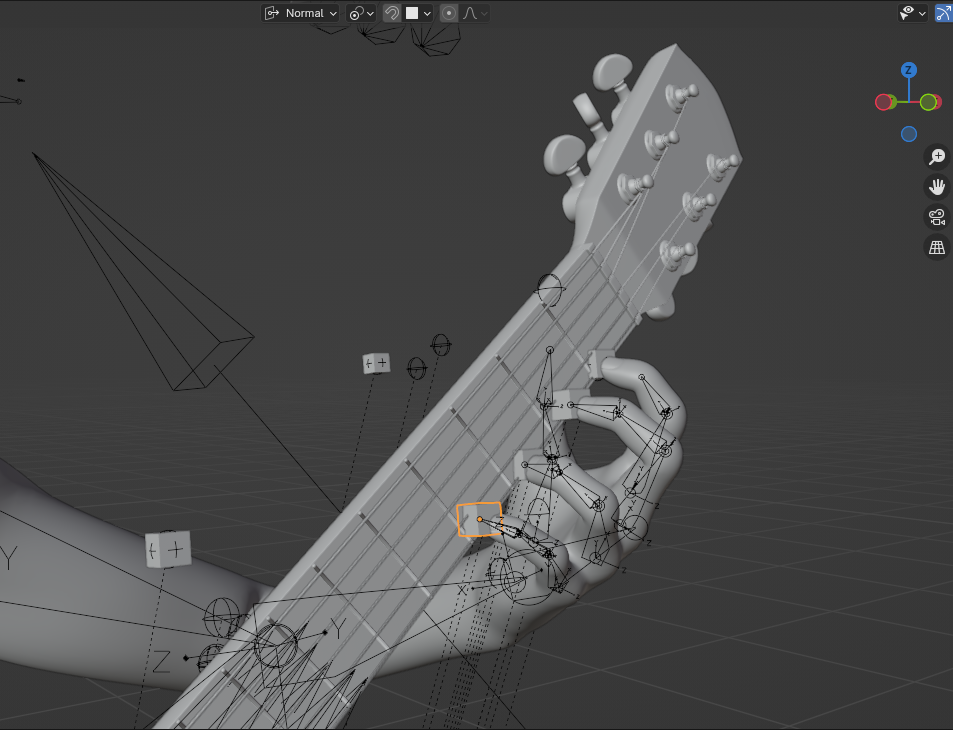
- 四指分别按住 6 弦 1、2、3、4 品（P1_Normal）  
  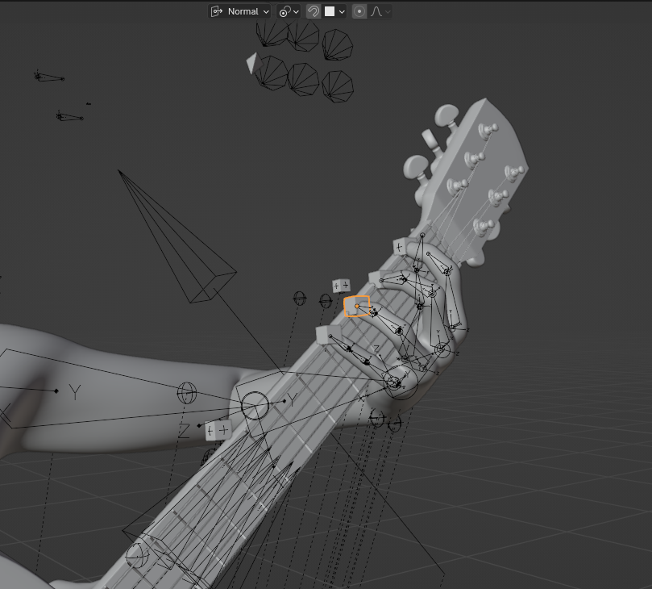
- 四指分别按住 1 弦 12、13、14、15 品（P2_Normal，古典吉他较难按）  
  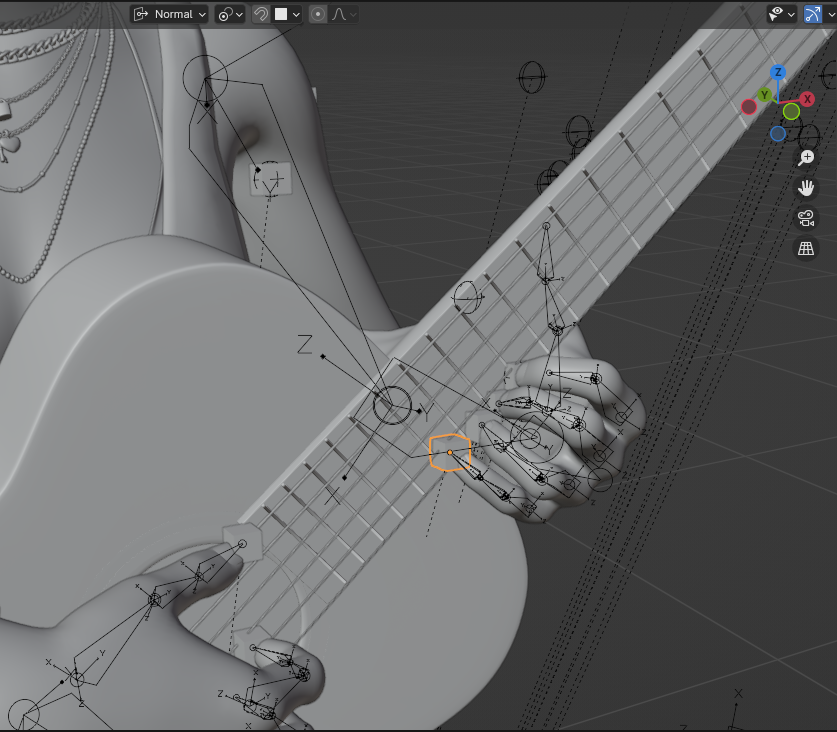
- 四指分别按住 6 弦 12、13、14、15 品（P3_Normal，容易穿模）  
  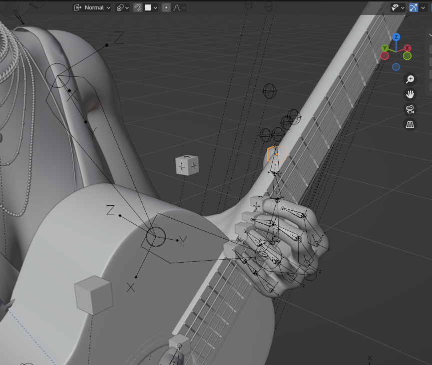
- 四指分别按住 1 弦 1 品、2 弦 2 品、3 弦 3 品、4 弦 4 品（P0_Outer）  
  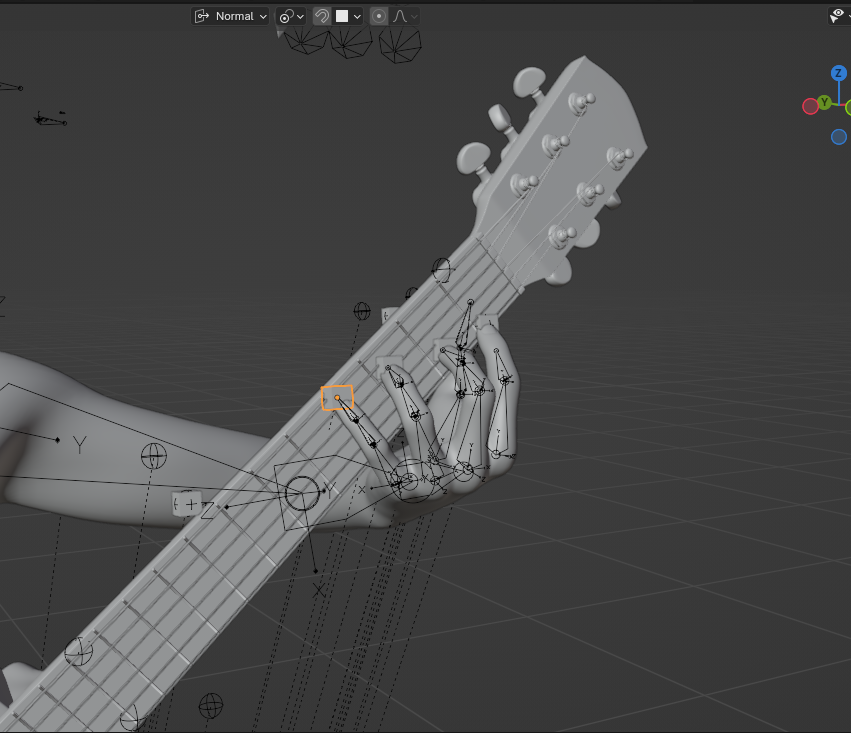
- 四指分别按住 6 弦 1 品、5 弦 2 品、4 弦 3 品、3 弦 4 品（P1_Inner）  
  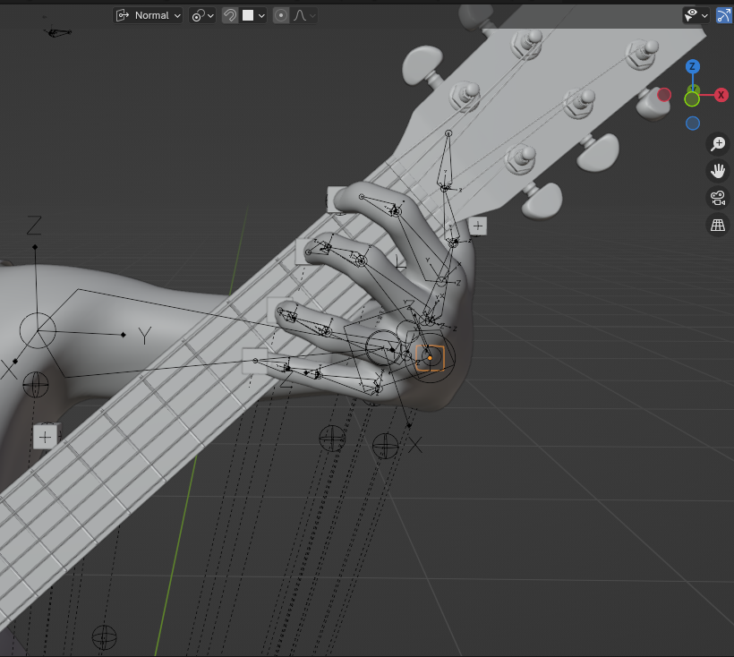
- 四指分别按住 1 弦 12 品、2 弦 13 品、3 弦 14 品、4 弦 15 品（P2_Outer，实际无法按但为了计算插值也把它摆出来了）  
  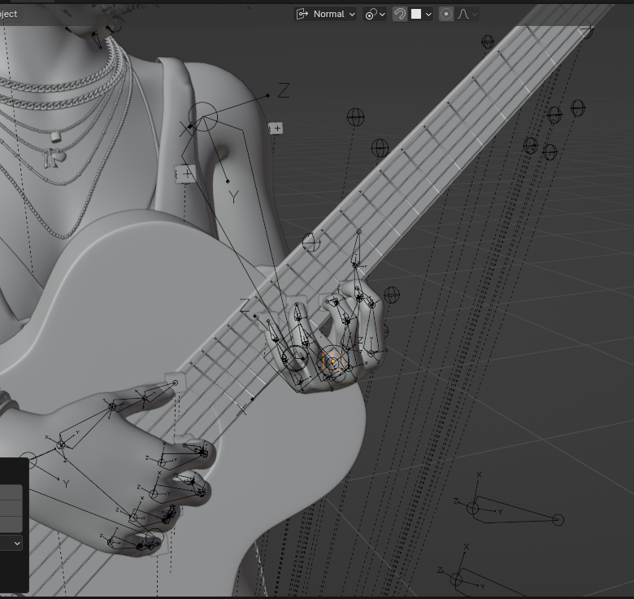
- 四指分别按住 6 弦 12 品、5 弦 13 品、4 弦 14 品、3 弦 15 品（P3_Inner，容易穿模）  
  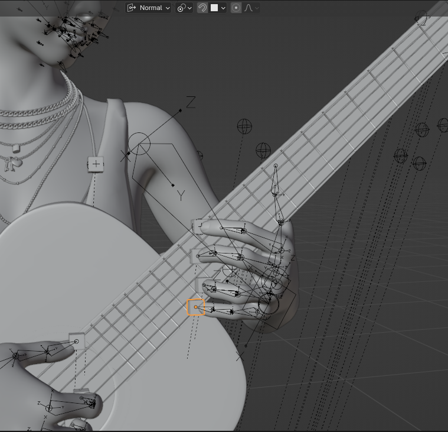

有了这 8 种手型的手掌位置、角度和 IK Pivot 后，可以通过插值计算任意把位和手型的手掌参数，实现任意手型的动画表现。

左手初始化涉及以下 Collection：

- **HandPositionControllers**：手掌控制器，控制手掌位置、大拇指位置和手掌 IK Pivot。命名前缀有 H（手掌）、HP（IK Pivot）、T（大拇指），后缀为 \_L（左手）、\_R（右手）。
- **FingerPositionControllers**：手指位置控制器，控制各手指的位置。命名前缀有 I（食指）、M（中指）、R（无名指）、P（小指），后缀同上。
- **RotationControllers**：手掌旋转控制器，控制手掌骨骼的旋转。仅有 H_Rotation_L 和 H_Rotation_R。

所有 controller 在 Blender 中用 cube 表示，便于 3D 视图查看。

每次摆好一个手型后，使用脚本 `import_left_controller_info.py` 的 `set_left_controller_info(position_name, status_name)` 方法保存当前手型的所有控制器信息。脚本还提供 `import_right_controller_info` 方法，可快速导入已有控制器信息，方便微调。

所有保存的 position 在 Blender 中用球体空对象表示，便于查看和管理。

#### 右手初始化

右手初始化的原理与左手类似，通过几个常见的手型，确定每根弦上不同手指的触弦点，以及对应的手掌位置、角度和 IK Pivot（部分模型可省略 IK Pivot）。

右手的几个关键手型如下（pima 分别代表拇指、食指、中指、无名指，符合古典吉他命名习惯）：

```python
right_hand_test_positions = {
    0: {"p": 2, "i": 0, "m": 0, "a": 0}, # p指3弦，ima都在1弦，类似演奏1弦轮指
    1: {"p": 3, "i": 1, "m": 1, "a": 0}, # p指4弦，im指2弦，a指1弦，过渡手型
    2: {"p": 4, "i": 2, "m": 1, "a": 0}, # p指5弦，i指3弦，m指2弦，a指1弦，标准起手型
    3: {"p": 5, "i": 4, "m": 3, "a": 2}, # p指6弦，i指5弦，m指4弦，a指3弦，低音弦标准型
    4: {"p": '_end', "i": '_end', "m": '_end', "a": '_end'} # 扫弦结束手型，pima都在1弦下方
}
```

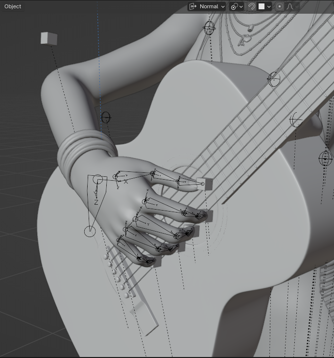
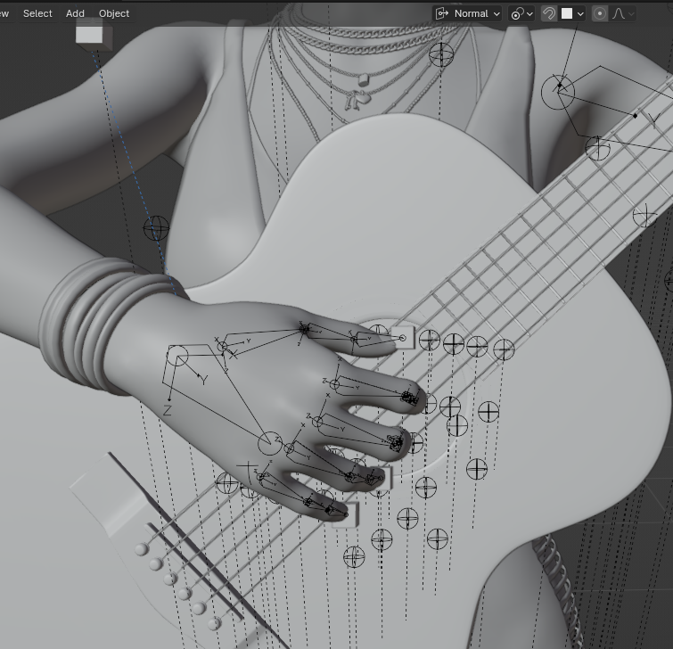
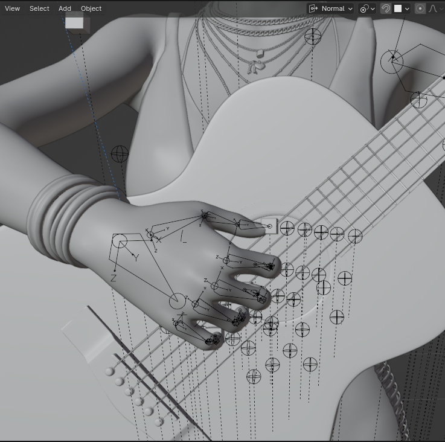
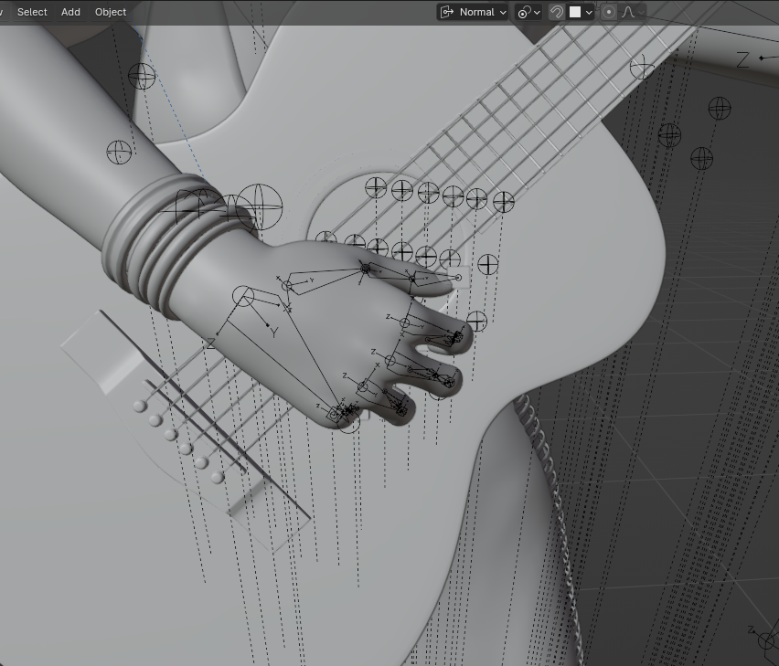

摆好上述手型后（position 1 可选），使用 `import_right_controller_info.py` 的 `set_right_controller_info(hand_position)` 方法保存手型信息。所有 position 在 Blender 中用球体空对象表示，便于查看。

实际上，不必保存所有手型。观察可知，触弦点大致排成一行，完成几个关键手型后可手动微调其它

### 其它

本项目的目的并不是为了输出给人类看的 tab,因为传统的 tab 只记录了需要按下的左手手指的运动，但对于未按弦的左手手指，缺乏对它们位置的记录。
当然，对于人类来讲，这无伤大雅，因为人类会自然的把不使用的手指移动到他觉得合适的地方。
但如果考虑到动画生成时，需要每个关键帧上的每个手指的位置信息，那么传统的 tab 就不够用了。
所以本项目的目标是输出一个包含每个 beat 的所有手指信息的序列，这样就可以为动画生成提供足够的信息。
